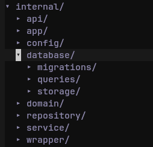

# MAJOR CHANGES
- ### Postgres conn migrated to pgxpool (must pass db conn to sqlc method):
**(see examples in user repository)**
- ### Custom logger ontop of zap implemented(instance is saved in parent context)
**(to retrieve a logger instanse use 'logger' package function FromCtx(context.Context))**

# CHANGELOG

## pkg/

- **some infrastructure files (like BD connection logic)are migrated here**
- **logger is here**
- **utils are here(hashing functions by now)**

## internal/

- **infrastructure directory gone, instead *database*  
with migrations, queries and generated storage**
- **wrappers directory is explicit now**
- **everything else is the same**

## wrappers/
- added new Error wrapper funcitions

## service/
- validator service on tag validations
